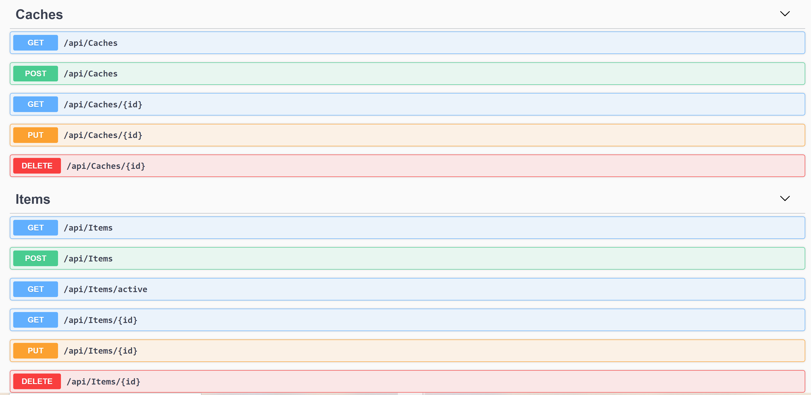
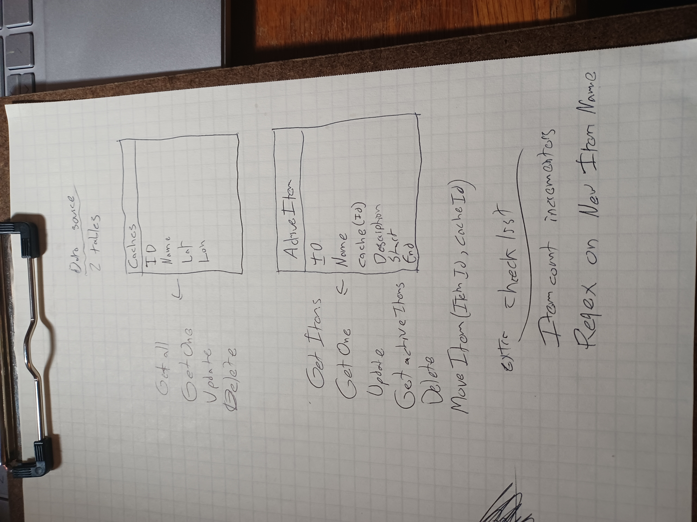
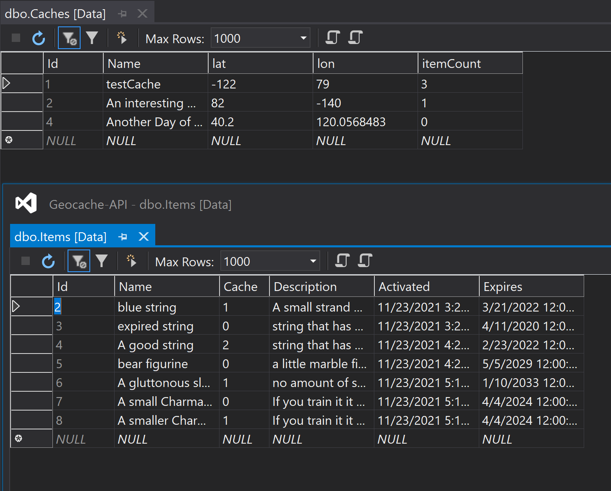
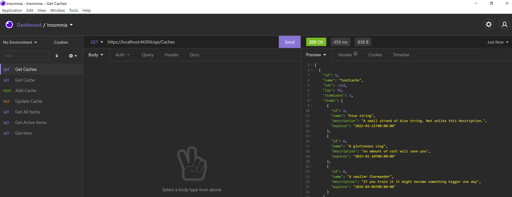

# GeocachingHQ-SDCE

Author: Steven Boston

This Geocache API is my solution for the coding exercise assigned as part of the hiring process with Geocaching HQ. The API was designed in Visual Studio using Entity Framework and the associated design patterns as the bones of the solution, with Enity Framework's built in SqlServer library as a database provider, Swashbuckle.AspNetCore to generate documentation and aid in testing functionality during development, and automated testing via Sqlite for Entity framework. 



## Planning



Because this challenge was a solitary project with a short timeline, I chose to do written diagramming and notes in lieu of an online project board or diagramming software. The database model has two primary tables, **Caches** and **Items**. The goal of the abstraction is to create a representation of a list of Geocaches in various locations and track their contents. 




## Endpoints

The api has a number of endpoints to assist in managing both Caches and Items: 

### Caches

- POST: /api/Caches
  - Creates a new cache, requires a JSON body in the form: 
    ```js
    {
      "name": "string",
      "lat": 0,
      "lon": 0
    }
    ```

- GET: /api/Caches
    - Returns a list of all caches, each with an array containing the items within. 
    

- GET: /api/Caches/{id}
    - Returns a single cache with the specified id in the same format as above. 

- PUT: /api/Caches/{id}
    - Endpoint for updating caches. Requires a JSON body: 
    ```js
    {
      "id": 0,
      "name": "string",
      "lat": 0,
      "lon": 0,
      "itemCount": 0
    }
    ``` 
- DELETE: /api/Caches/{id}
  - Deletes a cache with the specified Id.

### Items

- POST: /api/Items
  - Creates a new item, requires a JSON body: 
  ```js
  {
    "name": "string",
    "cache": 0,
    "description": "string",
    "expireYear": 0,
    "expireMonth": 0,
    "expireDay": 0
  }
  ```
  Note that cache refers to the id of the cache the item is located at, if desired. Item names are restricted to numbers, letters, and spaces, and have a maximum of 50 characters.

- GET: /api/Items
  - Returns a list of all items within the database.
- GET: /api/Items/active
  - Returns a list of active items (those which have not reached their expiration).
- GET: /api/Items/{id}
  - Returns the Item with the specified Id.
- PUT: /api/Items/{id}
  - Updates item with specified id. Requires JSON body: 
  ```js
  {
    "id": 0,
    "name": "string",
    "cache": 0,
    "description": "string",
    "activated": "2021-11-23T15:27:08.2034027",
    "expires": "2022-03-21T00:00:00"
  }
  ```

- PUT: /api/Items/{id}/{cache}
  - Moves an item with the specified id to the cache with the id specified in the cache field, provided that the item is active and the cache has space available. Returns updated item entry.

- PUT: /api/Items/remove/{id}
  - Removes the specified item from the cache it is in, if applicable. Returns updated item entry.

- PUT: /api/Items/clear
  - Finds and removes all expired items from their caches.

- DELETE: /api/Items/{id}
  - Deletes the item with the specified id.

## Additional Notes

The main feature I would consider adding if I had more time would be authorization/authentication for most of the non-GET routes. Another consideration (particularly for scalability) would be the efficiency of the PUT routes in items, but that wasn't something that ended up being within the time I had. I also chose to use .NET 5 rather than 6 because of my limited experience with the new features and my timeline's lack of tolerance for delays, so making adjustments and updating the versioning on the libraries would also be a priority target in terms of next steps. 

Please feel free to contact me via [LinkedIn](https://www.linkedin.com/in/steven-boston/) if you have any questions or hangups with setup.

Finally, special thanks to Primrose for her assistance on this project. 


